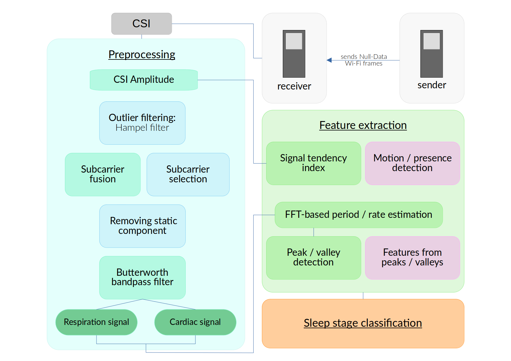

# bachelor-thesis
> [!WARNING]
> This repository will be archived once the thesis is completed and no further changes will be made after that point. Further development of the sleep monitoring system will take place in [this forked repository](TODO). 

This is the repository for the thesis ["Towards Real-world Wireless Sensing on the Edge: CSI-based Sleep Measurements with ESP32 Devices"](TODO). 
It contains the code for the online, on-device sleep monitoring system developed to be run on ESP32 devices as well as code for the data processing and analysis, and all figures and data used in the thesis. 

The following image provides an overview of the designed system. For a detailed description and theoretical background of the individual components, refer the [thesis](), and see the [receiver code](code/csi_receiver/) for the implementation. 

## Structure
The repository is structured as follows:
- `code` contains all the code
    - `R` contains all code written in R, this includes the code for the analysis as well as a script for preparing the CSV file to rerun processing of previously collected CSI samples on the ESP
    - `live_visualization` contains the python script for live visualization of the results of the sleep monitoring system
    - `notebooks` contains various Jupyter notebooks e.g. for precalculating parameters and creating and training the NN
    - `csi_sender` contains the ESP-IDF project code for the transmitter
    - `csi_receiver` contains the ESP-IDF project code for the receiver which performs all the processing and analysis of the CSI and is the heart of the sleep monitoring system
- `data/sleep_lab/clean_data` contains all data collected for testing the system

- `writing`: contains the thesis and figures
    - `final_figures`: contains all figures used in the final version of the thesis as well as figures used in this repository

## How to use
This is a coarse-grained quick start to getting the sleep monitoring system to run. For more detailed information see the ReadMes in the subfolders or comments / explanations directly in the specific files. on
1. This project uses the esp-idf, so make sure you have that installed, set up, and working correctly before continuing
   - see [Espressif's get-started guide](https://docs.espressif.com/projects/esp-idf/en/v5.1/esp32/get-started/) for installation options
   - you can run the example project to test whether everything works as expected
   - this project was created and tested using esp-idf version 5.1, so using that version is recommended although others might also work
2. Clone this repository e.g. using `git clone https://github.com/Cl4ryty/bachelor-thesis.git`
3. Configure and flash the sender
   - go into the csi_sender folder (`cd bachelor-thesis/code/csi_sender`)
   - set the target to the kind of ESP you are using e.g.
     - `idf.py set-target esp32` when using an ESP32
     - `idf.py set-target esp32s3` when using an ESP32-S3
   - configure any options you want in the menuconfig (`idf.py menuconfig`)
     - specific to this project, for the sender you can configure the rate that Wi-Fi frames are send - the default is 50Hz - if you change it, make sure to set the same value in the receiver settings!
   - build and flash e.g. using `idf.py build flash`
     - if you have multiple ESPs connected to the computer, or if the correct device isn't found automatically, you should specify the port e.g. `idf.py -p /dev/ttyUSB0 build flash`
4. Configure and flash the receiver
   - go into the csi_receiver folder (`cd ../csi_receiver/`)
   - set the target to the kind of ESP you are using e.g.
     - `idf.py set-target esp32` when using an ESP32
     - `idf.py set-target esp32s3` when using an ESP32-S3
   - configure any options you want in the menuconfig (`idf.py menuconfig`)
     - specific to this project, you can configure the follow options for the receiver:
       -  Wi-Fi configuration: ssid, password, Wi-Fi channel, and the maximum number of connected station the AP accepts
       -  Logging settings: enabling logging to SD card, to serial, and choosing which information to log including logging different things to different outputs
   - build and flash e.g. using `idf.py build flash`
     - if you have multiple ESPs connected to the computer, or if the correct device isn't found automatically, you should specify the port e.g. `idf.py -p /dev/ttyUSB1 build flash`
   - once flashing was successful, you can monitor the serial output (`idf.py monitor`)

> [!IMPORTANT]
> Make sure that the sender is running before plugging in the receiver. Otherwise you will get invalid data in the beginning due to having too few samples as input to the FFT for the rate estimation and subcarrier fusion.  
5. Run live visualization
   - the live visualization can plot features logged to serial or UDP
   - which of the logged features are plotted can be selected through command line arguments (see the beginnning of the file for available options)
   - to run visualization of features logged to serial run the following command from within the `csi_receiver` folder: `idf.py monitor | python ../live_visualization/visualization.py`
   - when plotting the features logged to UDP just running the visualization script is sufficient, however, the device running the script needs to be connected to the receiver's Wi-Fi network to receive the UDP broadcasts
